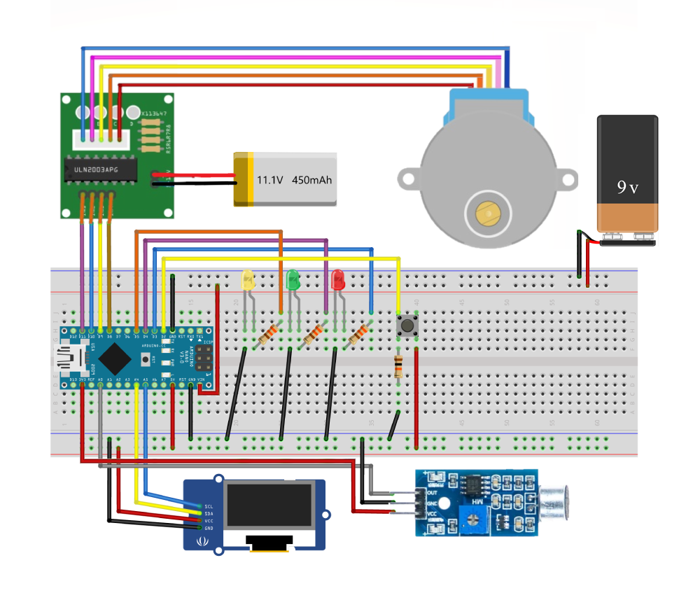

# 🎸 DIY-Guitar-Tuner-Arduino

[🇺🇸 English](#-english) | [🇹🇷 Türkçe](#-türkçe)

---

## 🇺🇸 English

**DIY-Guitar-Tuner-Arduino** is an automated, smart tuning system that detects guitar notes via a microphone and uses a high-torque stepper motor to adjust the tuning pegs. This project focuses on stability and torque, utilizing a dual-power system to handle physical tuning resistance.

### 🌟 Key Features
* **Automatic Tuning:** Real-time motor control for hands-free tuning.
* **Precision Pitch Detection:** Zero-crossing frequency analysis optimized for guitar strings.
* **High Torque Performance:** Specifically designed to rotate heavy guitar pegs using an 11.1V LiPo supply.
* **Visual Interface:** Minimalist UI on an SSD1306 OLED display with status LEDs.

### 🔌 Detailed Wiring (Pinout)

| Component | Arduino Pin | Connection & Component Detail |
| :--- | :--- | :--- |
| **Microphone (Generic LM393)** | `A0` | **VCC to 3.3V** (For cleaner audio signal) |
| **OLED Display (SSD1306)** | `A4 (SDA) / A5 (SCL)` | Connected to 5V & GND |
| **Stepper Driver (ULN2003)** | `D8, D9, D10, D11` | Input pins for IN1-IN4 |
| **Status LEDs (R, G, Y)** | `D3, D4, D5` | Each connected with a **330Ω resistor** |
| **Push Button** | `D2` | Connected with a **10kΩ Pull-down resistor** |
| **Logic Power (Arduino)** | `Vin` | Powered by a **9V Battery** |
| **Motor Power (ULN2003)** | `VCC / GND` | Powered by an **11.1V LiPo Battery** (High Torque) |

### ⚠️ Warning: Heat Dissipation
> **Using an 11.1V LiPo battery provides high torque but may cause the stepper motor to heat up quickly. Do not keep the motor energized for long periods and monitor the temperature during operation.**

### 🖼️ Circuit Schematic

*Note: High-torque setup with dual-power supply (11.1V LiPo & 9V Battery).*

### 🛠️ Technical Strategy
* **Power Management:** Uses an 11.1V LiPo for the motor to ensure enough torque for tuning pegs, while a separate 9V battery powers the Arduino logic to prevent voltage drops.
* **Noise Reduction:** The microphone is powered via the 3.3V rail to minimize electrical interference during frequency analysis.

### 🤝 Acknowledgements
This project was initiated during my internship at **Robotistan** and later refined with custom code optimizations and hardware improvements.
👉 [View Original Tutorial on Robotistan](https://maker.robotistan.com/gitar-akort-cihazi/)

---

## 🇹🇷 Türkçe

**DIY-Guitar-Tuner-Arduino**, mikrofon aracılığıyla gitar notalarını algılayan ve yüksek torklu bir step motor kullanarak burguları otomatik olarak ayarlayan akıllı bir akort sistemidir. Bu proje, fiziksel burgu direncini yenmek için çift güç kaynaklı bir yapı ve kararlı bir frekans analiz algoritması kullanır.

### 🌟 Temel Özellikler
* **Otomatik Akort:** El değmeden akort için gerçek zamanlı motor kontrolü.
* **Hassas Perde Algılama:** Gitar telleri için optimize edilmiş frekans analizi.
* **Yüksek Tork Performansı:** 11.1V LiPo beslemesi ile gitar burgularını çevirecek güçte tasarım.
* **Görsel Arayüz:** Durum LED'leri ve SSD1306 OLED ekran üzerinde minimalist kullanıcı arayüzü.

### 🔌 Detaylı Bağlantı Haritası (Pinout)

| Bileşen | Arduino Pini | Bağlantı ve Donanım Detayı |
| :--- | :--- | :--- |
| **Mikrofon (Generic LM393)** | `A0` | **3.3V Pininden beslenir** (Temiz sinyal için) |
| **OLED Ekran (SSD1306)** | `A4 (SDA) / A5 (SCL)` | 5V ve GND hattına bağlıdır |
| **Step Motor Sürücü (ULN2003)** | `D8, D9, D10, D11` | IN1, IN2, IN3, IN4 girişleri |
| **Durum LED'leri (K, Y, S)** | `D3, D4, D5` | Her birine **330Ω direnç** bağlıdır |
| **Başlatma Butonu** | `D2` | **10kΩ Pull-down direnci** ile bağlıdır |
| **Mantıksal Güç (Arduino)** | `Vin` | **9V Pil** ile beslenir |
| **Motor Gücü (ULN2003)** | `VCC / GND` | **11.1V LiPo Pil** (Yüksek Tork için) |

### ⚠️ Uyarı: Isınma Tehlikesi
> **11.1V LiPo pil kullanımı yüksek tork sağlar ancak step motorun hızla ısınmasına neden olabilir. Motoru uzun süre enerji altında bırakmayın ve çalışma sırasında sıcaklığı kontrol edin.**

### 🖼️ Devre Şeması

*Not: Çift güç kaynaklı (11.1V LiPo ve 9V Pil) yüksek torklu kurulum.*

### 🛠️ Teknik Strateji
* **Güç Yönetimi:** Motorun burguları döndürebilmesi için 11.1V LiPo kullanılmış; Arduino ise voltaj dalgalanmalarından etkilenmemesi için ayrı bir 9V pil ile beslenmiştir.
* **Gürültü Engelleme:** Frekans analizinde hata payını düşürmek için mikrofon modülü 3.3V hattından beslenerek elektriksel gürültü azaltılmıştır.

### 🤝 Teşekkür
Bu proje **Robotistan** stajım sırasında geliştirilmeye başlanmış; daha sonra kod optimizasyonları ve donanım iyileştirmeleri ile tarafımdan finalize edilmiştir.
👉 [Robotistan'daki Orijinal İçeriği İncele](https://maker.robotistan.com/gitar-akort-cihazi/)

---

**License:** MIT License  
**Developed by:** Salih Mete Alkan
